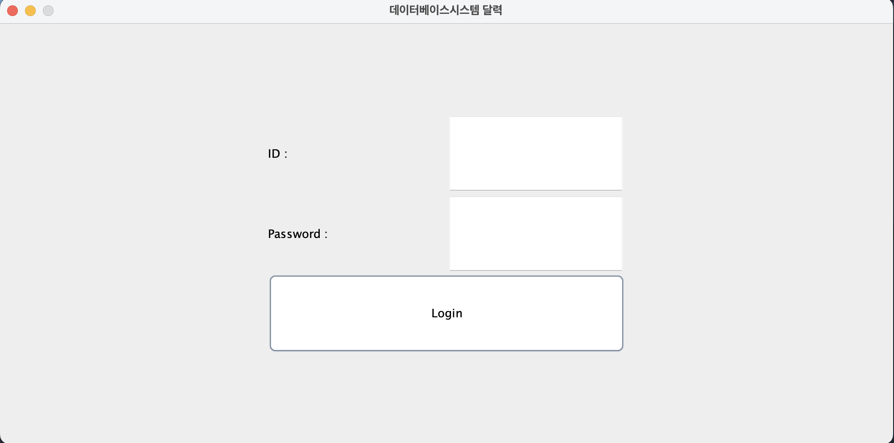
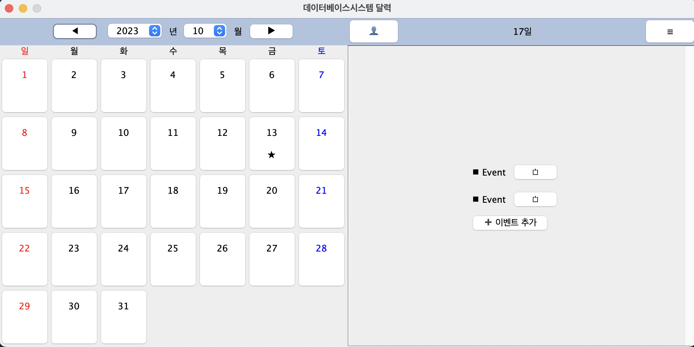
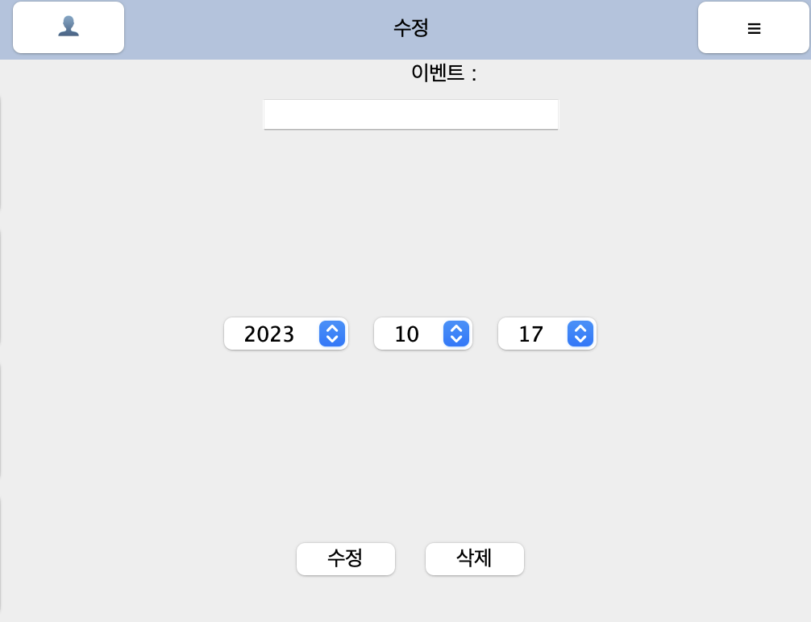
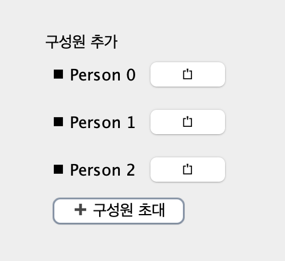
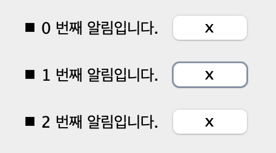
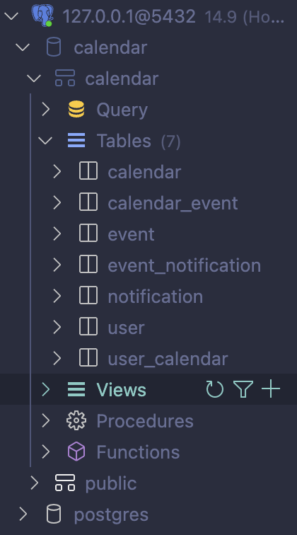

# Database Systems Assignment#2
2022094093 김도훈 데베시 과제 2  
Dept. of Data Science

## Summary
1. 자바 프로그램을 사용해 달력의 UI를 만들었다.  
2. 외부 스키마, 개념 스키마, 내부 스키마의 단계로 나누어 스키마를 시각화하였다.  
3. 시각화한 스키마에 맞춰 PostgreSQL 코드를 작성하였다.

## Design and Implementation of UI  
다음과 같이 UI를 만들었다.

#### 로그인 화면
  

첫 시작시 다음의 화면이 나온다. 원하는 계정으로 로그인하는 페이지이다. 비밀번호는 JPasswordField를 사용해 입력시 암호화되어 출력되므로, 비밀번호 유출과 같은 문제를 방지한다.  

#### 메인 화면


로그인 이후 다음의 화면이 나온다. 좌측에는 달력을 볼 수 있고, 이벤트가 있는 날에는 별 표시가 추가된다. 날짜를 선택하면 우측에 해당 날짜에 추가되어있는 이벤트를 출력한다. 

#### 수정 화면


이벤트를 수정하고자 한다면 다음의 화면으로 이벤트를 수정하게 된다. 이벤트의 삭제 또한 같은 화면에서 수행할 수 있다.

#### 초대 화면


일정을 공유할 구성원을 다음의 화면에서 추가할 수 있다.  

#### 알림 화면


알림 설정된 이벤트를 다음의 화면에서 확인할 수 있다.


## 스키마 디자인  
스키마의 토대는 강의자료실의 과제 안내 자료 (Design Family Calendar)를 참고하였다.  
첨부된 다음의 쿼리를 통해 필요한 테이블을 만들었다.  
```bash
Schema.sql  # 스키마 생성

UserTable.sql  # 유저 정보
UserCalendarTable.sql  # 유저에게 보여질 캘린더
CalendarTable.sql  # 그룹별로 보여질 캘린더 
CalendarEventTable.sql  # 캘린더에 표시될 이벤트
EventTable.sql  # 이벤트 정보
NotificationTable.sql  # 알림
EventNotificationTable.sql  # 이벤트 알림
```


calendar 데이터베이스의 calendar 스키마에 7개의 테이블이 정상적으로 추가되었다.

## Known Problems
현재 조건에 맞는 (로그인 여부 확인, 버튼 클릭 등) 화면을 띄우는 기능은 구현하지 않아, **Main.java** 파일에서 보고자 하는 화면을 일일이 표시하여야 구성한 UI를 볼 수 있다. 이번 과제가 UI 디자인 및 스키마 생성인 만큼 자바 프로그램 개발은 여기서 중단하며, 세 번째 과제에서 이러한 기능을 구현해 매끄러운 프로그램 흐름을 만들고자 한다.

## Comments
작성된 코드는 깃허브에 업로드되어 있습니다.  
https://github.com/kdh-yu/DatabaseSystem/blob/main/Assignment1.md