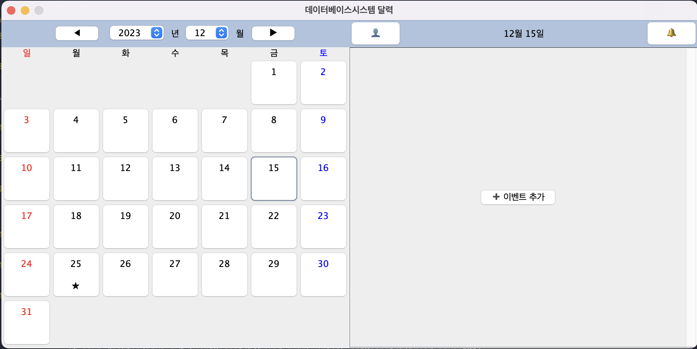

# Database System Assigment#3  
2022094093 김도훈 데베시 과제 3
Dept. of Data Science

## Summary  
구현된 UI에, 다음의 기능이 추가되었다.
1. 로그인 및 회원가입
2. 특정 날짜에 이벤트 추가
3. 특정 날짜에 존재하는 이벤트 제거
4. 날짜 선택 및 이벤트 존재 여부에 따른 달력상의 표시
5. 1달 이내에 발생 예정인 이벤트 알림

## 로그인 및 회원가입  
회원가입시 유저 정보 테이블에 정보를 INSERT 하여 회원가입 기능을 구현하였다.  

유저 테이블에서 입력된 조건을 기준으로 SELECT 하는 쿼리를 작성하였다.
유저 id는 UNIQUE 하므로 하나라도 조회가 되었다면 정보에 맞는 유저가 존재함을 알 수 있다.
만약 조회 실패시 간단한 경고 정도를 준다.

## 메인

다음 화면에서 각각을 볼 수 있다.
좌측 패널 위의 JComboBox를 통해 특정 날짜로의 접근이 가능하고, 달력 내에 있는 버튼 클릭시 우측 패널에 정보가 표시된다. 이벤트 추가를 사용해, 선택한 날짜에 이벤트를 추가할 수 있다.  
좌측 달력에서 날짜 아래에 별 표시의 여부를 통해 그 날짜에 이벤트가 존재하는지, 존재하지 않는 지에 대한 정보를 알 수 있다.

## 이벤트 추가

이벤트 추가 버튼을 누르면 다음의 화면으로 바뀌며, 정보를 입력한 후 추가 버튼을 눌러 이벤트를 추가할 수 있다.

추가되면 별 표시가 갱신되고, 이벤트가 정상적으로 추가되었음을 확인할 수 있다.

## 이벤트 수정/삭제

추가된 이벤트 우측의 버튼을 통해 이벤트 수정 창으로 들어가고, 수정 및 삭제가 가능하다.

## 이벤트 알림

이벤트 창에는 한 달 내에 발생하는 이벤트 정보를 불러온다.

## 미구현 기능
1. 이벤트 검색  
   - 이벤트 검색 버튼 디자인부터, 검색 조건 선택 과정에서 혼란이 시간 부족으로 인해, 구현하지 못 하였다.
2. 주간 보기
   - 요구 사항에 있는 것은 확인했지만, 시간 제한으로 인해 월간 보기에서 멈추기로 하였다.
3. 유저 관리 기능
   - 현재 존재하는 유저의 정보를 바꾸는 등의 정보 관리 기능은 구현하지 않았다.

## 개선 사항  
- 폴더 내에 바로 .java 파일을 만드는 것이 아닌, 프로젝트 생성 후 여기에 추가하는 것으로 실행 문제를 어느정도 해결했다. 동시에, referrencedLibraries 관리를 통해 postgresql 드라이버가 제대로 불러와지도록 하였다.
- 테이블 (스키마)의 변화도 어느정도 있었는데, 이는 많지 않은 기능 구현에 추가적인 정규화 과정을 줄여 구현 편의성을 위해서였다.
- 패널을 불러올 때 App Constructing 과정에서 선언 및 초기화 후 필요할 때 불러오는 방식을 택했었는데, 최종 버전에서는 이것이 수정되었다. Constructing 단계에서 선언하고, 매 정보를 불러올 때 마다 새로 객체를 생성함으로써 비동기적인 기능 구현을 가능케 했다.

## 아쉬운 점
UI 구현에 너무 많은 시간을 쓴 것 같다. 데이터베이스와의 연결은 둘째 치고, 자바 UI 구성이 너무 힘들어 많은 기능을 구현하지 못한 것 같다. 웹페이지 기반, 또는 파이썬 기반의 프로그램으로 만들었다면 아마 데이터베이스와 관련한 기능이 많이 구현될 수 있었을 것 같아 아쉬움이 남는다.

